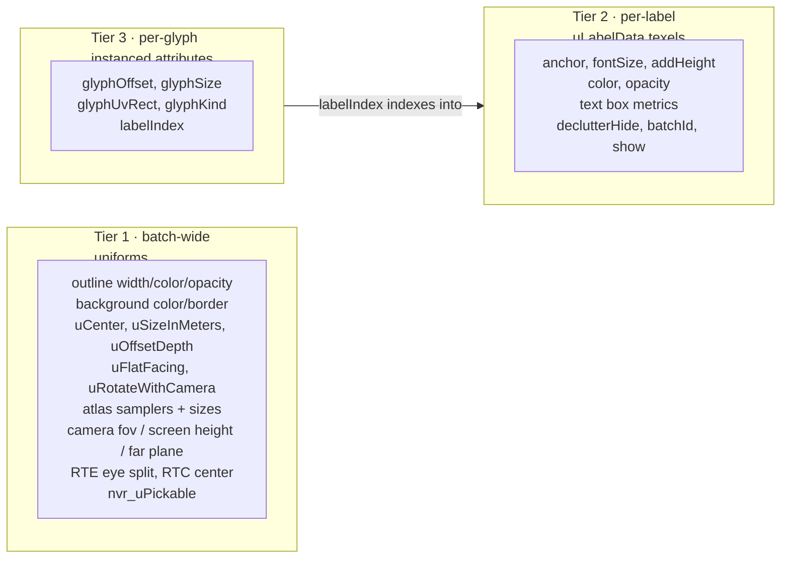

# Text Batching

How `@navaramap/three` draws every text label in a tile-layer with a **single
draw call**, and how a label can change its text without rebuilding the batch.
For the placement pass that decides which of those labels stay visible, see
[DECLUTTER.md](DECLUTTER.md); for the broader pipeline, see
[ARCHITECTURE.md](ARCHITECTURE.md).

## Overview

One `BatchedSdfTextMesh` is created per Rust `TextMesh` event — i.e. per
tile, per layer (`event/features/text.ts`). It owns exactly one
`InstancedBufferGeometry` and one `ShaderMaterial`, and renders through one
`drawArraysInstanced(TRIANGLES, 0, 6, N)`: a shared unit quad, `N` instances.

**An instance is a glyph, not a label.** A tile with 60 labels averaging 5
glyphs each is one draw call with ~360 instances, not 60 draw calls.

That single-call constraint is the whole design pressure. A draw call is
bounded by one geometry plus one material, so anything that varies inside it
must be indexable per-instance. Uniforms are constant for the entire call —
which is why the batch's data is split three ways.

## The three tiers

Every value the shaders need falls into exactly one tier. Getting a value into
the wrong tier is the main way to break batching, so the split is worth
knowing before touching either shader.



**Tier 1** works because a batch is already keyed by `(font, quality)` and
built from one material — these were never actually per-label. Text quality is
immutable per batch for the same reason: all labels sample one atlas, so
flipping it requires a new batch.

**Tier 3** is ordinary instancing.

**Tier 2** is the interesting one: an instance is a glyph, but these values
vary per *label*, and a label owns many glyphs. The `labelIndex` attribute is
the join key — a foreign key from a glyph to its label's row block.

## The label data texture

Per-label state lives in an unfiltered `RGBAFormat` + `FloatType` `DataTexture`
that the **vertex** shader reads with `texelFetch`
(`mesh/sdfText/labelData.ts`). Five texels per label:

| row | x | y | z | w |
| --- | --- | --- | --- | --- |
| 0 `POSITION_HIGH_SIZE` | anchor high .x | .y | .z | `fontSize` |
| 1 `POSITION_LOW_HEIGHT` | anchor low .x | .y | .z | `addHeight` |
| 2 `COLOR_OPACITY` | color.r | .g | .b | `opacity` |
| 3 `BOX` | textWidth | textHeight | bgMinY | bgMaxY |
| 4 `STATE` | declutterHide | batchId | show | *(reserved)* |

Rows 0–1 carry the RTE high/low anchor split (see
[RTC_VS_RTE.md](RTC_VS_RTE.md)); in RTC mode row 0 holds the tile-relative
position and row 1's `xyz` is unused. The layout is identical across both so
the shader's row indices never branch. The anchor only needs `xyz`, so the
leftover `w` channels absorb two scalars at no cost.

Addressing is a linear texel index over a **fixed-width** texture, mirroring
`fogLight.frag.glsl`:

```glsl
vec4 nvr_readLabel(int slot, int row) {
    int i = slot * LABEL_ROWS + row;
    return texelFetch(uLabelData, ivec2(i % uLabelTexSize.x, i / uLabelTexSize.x), 0);
}
```

The width is fixed (64 texels) precisely so growth only changes the height —
an existing label's address stays valid across a resize, and the old data is
copied straight in.

`LabelRow` and `LABEL_ROWS` live with the **enhancer**
(`material/enhancer/sdfText/sdfTextBaseEnhancer/types.ts`), not with the
texture, because they are a shader contract: the enhancer injects `LABEL_ROWS`
as a GLSL define, so the CPU row table and the shader's stride cannot drift.
`shader.test.ts` pins that, including that the rows form a dense `0..n-1`
range.

> **Why a texture rather than replicating per-label values onto every glyph
> attribute?** Both render identically, but replication makes a per-label
> change cost O(glyphs). The declutter fade runs every frame; through the
> texture a fade step is one float per label regardless of glyph count. It also
> decouples the two allocations — when a text change relocates a label's glyph
> run, its label row does not move.

## Glyph runs and the slot allocator

Each label owns a **contiguous run** of glyph instance slots handed out by
`GlyphSlotAllocator` (`mesh/sdfText/glyphSlots.ts`). Run capacities are rounded
up to powers of two (floor 4), with a free list per size class.

This is what makes variable-length text cheap:

```ts
realloc(run, count) {
  if (run && capacityFor(count) === run.capacity) return run;  // same slots
  if (run) this.free(run);
  return this.alloc(count);
}
```

- **Same size class** (`"Paris"` → `"Lyon"`): the run is returned unchanged.
  The caller overwrites in place and blanks the leftover tail.
- **Class change**: the old run goes back to its free list, a new one is taken,
  and the vacated slots are blanked.
- Either way only that label's slots are rewritten, and the GPU upload is a
  `bufferSubData` of exactly that range via `addUpdateRange`.
- **Growth** doubles the buffers and is the only path that re-uploads
  everything. It is amortized O(1).

Worst-case internal fragmentation is 2×. That is the deliberate price of never
relocating a label that merely changed length; there is no compaction pass, and
none should be added without a measurement showing it matters.

`geometry.instanceCount` tracks the allocator's high-water mark, so the draw
covers holes left by freed runs as well as live runs. Both are blanked, which
is what the fourth `glyphKind` value is for.

## `glyphKind`

One float per instance encodes four roles (`GlyphKind` in
`mesh/sdfText/glyphBuffers.ts`, mirrored by the `GLYPH_KIND_*` defines in
`sdfText.vert.glsl`):

| value | meaning |
| --- | --- |
| `0` SDF | sample the single/multi-channel SDF atlas |
| `1` COLOR | sample the COLRv1 RGBA atlas — lets one batch mix text and emoji |
| `2` BACKGROUND | this label's background quad |
| `3` EMPTY | unused tail of an over-allocated run, or a hole from a freed run |

`EMPTY` is culled on the first line of `main()`, before any texture read. New
buffer capacity is explicitly filled with `EMPTY`: a zero-filled array would
read as `SDF` and draw garbage quads.

`BACKGROUND` always occupies `run.start`, so a label's background is submitted
before its own glyphs. The fragment shader's outline-seam fix depends on that
ordering. Whether it actually draws is a batch-wide `uShowBackground` test in
the shader, so toggling backgrounds costs no buffer writes.

## Quad orientation

A glyph's vertex position is its unit quad offset from the label's anchor **in
view space**: `mvPosition + vec4(localPos.x * right + localPos.y * up, 0.0) *
scaleFactor`. All four orientation modes differ only in that `(right, up)`
pair, which `nvr_labelBasis` resolves from two batch-wide booleans —
`uFlatFacing` picks the plane, `uRotateWithCamera` picks whether the quad
follows the camera or is frozen in the anchor's east-north-up frame:

| `uFlatFacing` | `uRotateWithCamera` | right, up | behaviour |
| --- | --- | --- | --- |
| `false` | `true` | view `+x`, `+y` | screen-aligned billboard (the default) |
| `false` | `false` | east, surface normal | signboard standing on the surface |
| `true` | `true` | screen `+x` projected onto the tangent plane | lies on the surface, yawed to keep reading left-to-right |
| `true` | `false` | east, north | lies on the surface, pinned north-up |

A zero-Z offset is exactly what makes a quad screen-aligned, so only the first
row is camera-relative; the rest rotate a *world* direction into view space
(`viewMatrix * vec4(dir, 0.0)`, the idiom `mvr_getMvHeightOffset` already uses).
The surface normal is `normalize(absTransformed)` — the same spherical
approximation as the height offset, reusing the ECEF position horizon culling
already reconstructed.

The two `uRotateWithCamera == false` rows share one branch: both are the
anchor's east-north-up frame, differing only in whether up is north (flat) or
the surface normal (upright). Because neither reads the camera, the basis is a
pure function of the anchor and has no camera-dependent singularity.

Both booleans are uniforms rather than defines: they are batch-wide, so the
branches are coherent across a draw call, and toggling the mode costs no shader
recompile.

`nvr_labelBasis` then spins that basis by `uRotation` (the material's
`rotation`, converted from degrees to radians CPU-side) **inside the quad's own
plane**, turning both axes together. Because it composes with the resolved
basis rather than replacing it, one implementation covers every mode: it spins
a billboard on screen and swings a surface label like a compass bearing, and
the quad never leaves the plane its mode put it in. The sine is negated
relative to the usual counter-clockwise matrix so a positive angle reads
clockwise from in front, matching compass bearings and MapLibre's
`text-rotate`.

The pivot is the **anchor**: glyph offsets are measured from it once `uCenter`
has shifted the text block, so `center` is what decides where inside the text
the label turns about — `{x: 0.5, y: 0.5}` spins it about its middle,
`{x: 0.5, y: 0.0}` about the bottom of the block.

> **`rotateWithCamera` must not be implemented as a screen-space spin.** An
> earlier revision gave the screen-plane quad an up vector of *north projected
> onto the screen*. That inverts every label whenever the camera faces south —
> north then points down-screen — and its direction is undefined outright when
> north lies along the view axis. Freezing the quad in the world frame, as
> above, is what makes the mode well-posed.

Two consequences worth knowing:

- **The background quad shares the basis**, so it stays coplanar with its
  glyphs in every mode.
- **A world-frozen quad has a back and an edge.** `textFacing: "upright"` with
  `rotateWithCamera: false` is a real signboard: invisible edge-on from
  directly above, and mirrored when viewed from behind. That is inherent to a
  fixed-orientation quad, not a defect. Its face points south, so the default
  north-looking camera reads it.
- **The batch material is `DoubleSide`.** Backface culling would delete a
  world-locked label outright as soon as the camera crossed to its far side,
  which is the one case where a mirrored label is the wanted result. The
  camera-following modes never present a back face, so they pay nothing for
  it, and `screenSpaceNormal()` in the fragment shader already flips a
  away-facing normal before it reaches the G-buffer.
- **Declutter still measures a screen-aligned box.** The Rust kernel projects
  the anchor and scales the label's em box by pixels-per-meter
  (`crates/navara_wasm_api/src/declutter.rs`), which ignores the foreshortening
  and rotation a flat label picks up. The box is therefore an over-estimate for
  `textFacing: "flat"` — conservative (it hides slightly more than it must),
  never an under-estimate.

## Picking

`sdfText.frag.glsl` deliberately does **not** include
`chunks/batch_definition.glsl`, which declares `nvr_uBatchId` as a uniform —
that only works when one material draws one feature. The batch id instead
travels per-label (row 4) into a `flat varying vBatchID`, the same approach
`instancedSprite.frag.glsl` takes. `nvr_uPickable` stays a uniform because pick
mode is batch-wide.

## Gotcha: three caches the instance ceiling

> three.js sets `geometry._maxInstanceCount` on the **first** VAO bind (guarded
> by `=== undefined`) and only clears it when the geometry is *disposed*. Every
> draw then clamps to `min(geometry.instanceCount, geometry._maxInstanceCount)`.

Replacing instanced attributes with larger ones — the normal way to grow a
pooled instance buffer — does **not** raise that ceiling. Without intervention
a batch stays pinned to whatever capacity it had when it was first rendered,
and every label added afterwards silently never draws.

`GlyphBuffers.ensureCapacity` therefore deletes the cached field after growing.
There is no public API for this; deleting it is what three itself does on
dispose.

This fails silently — no console error, `geometry.instanceCount` reads correct
on the JS side, and the draw call is still issued. The symptom that identifies
it: content renders correctly when the object is **recreated** (its buffers
grow before the first render) but not on the original load path. Confirming it
requires reading the instance count at the GL level, e.g. patching
`drawArraysInstanced` and logging its last argument.

## Constraints and trade-offs

- **Draw order.** Labels paint in slot order, not three's back-to-front
  transparent sort. `depthTest` + `depthWrite` + the fragment shader's
  `gl_FragDepth` writes resolve overlaps, and decluttered labels do not overlap
  by construction. Only overlapping labels with `depthTest: false` *and*
  declutter off are affected. MapLibre and deck.gl make the same trade.
- **`frustumCulled` stays `false`.** Geometry positions are unit quads and the
  real transform happens in the shader, so a three.js bounding sphere would be
  meaningless. Horizon culling in the shader covers the far side of the globe.
- **Labels are created lazily** on the first per-feature setter, keyed by a
  sparse `batchIndex → label` map. MVT tiles routinely carry thousands of
  features where only a handful get text; sizing eagerly to the anchor count
  would waste hundreds of KB per tile.
- **A material update overwrites per-feature style.** `_applyUpdate` writes the
  material's `color`/`opacity`/`size`/`height` to every label, clobbering
  evaluator overrides. This predates batching and is preserved deliberately.

## Key files

| File | Role |
| --- | --- |
| `shaders/glsl/sdfText.vert.glsl` | `nvr_readLabel`, the `GLYPH_KIND_*` culls, `nvr_labelBasis` + RTE/RTC transform |
| `shaders/glsl/sdfText.frag.glsl` | SDF/MTSDF and COLRv1 sampling, outline, background, pick encoding via `vBatchID` |
| `web/navara_three/src/mesh/sdfText/batchedSdfText.ts` | `BatchedSdfTextMesh` — label records, the engine/evaluator API, declutter participation, atlas retain/release |
| `web/navara_three/src/mesh/sdfText/glyphBuffers.ts` | Instance attributes, partial uploads, capacity growth, `GlyphKind` |
| `web/navara_three/src/mesh/sdfText/glyphSlots.ts` | `GlyphSlotAllocator` — size classes, free lists, `realloc` |
| `web/navara_three/src/mesh/sdfText/labelData.ts` | `LabelDataTexture` — addressing, writes, growth |
| `web/navara_three/src/mesh/sdfText/layout.ts` | Pure layout: line breaking, RTL direction, shaping result → glyph quads |
| `.../enhancer/sdfText/sdfTextBaseEnhancer/types.ts` | Batch-wide props/state/refs, plus `LabelRow` / `LABEL_ROWS` (the shader contract) |
| `web/navara_three/src/event/features/text.ts` | Creates one batch per Rust `TextMesh` event |
| `web/navara_three/src/mesh/sprite/instancedSprite.ts` | The sibling batched mesh; text follows its conventions |
